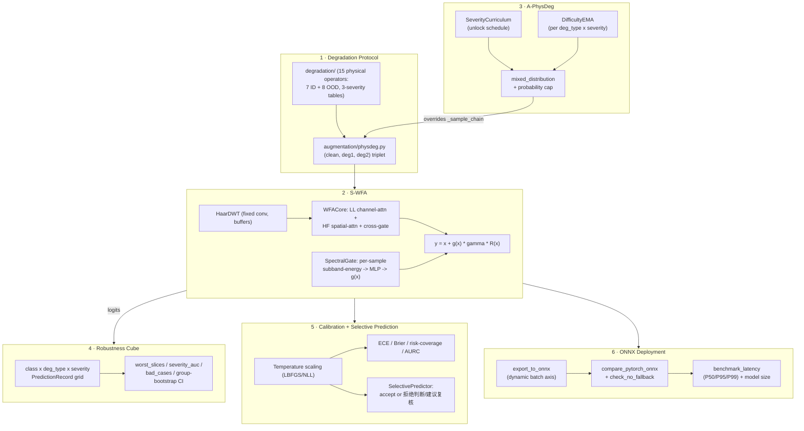

# Vision Robustness Toolkit

**A from-scratch toolkit for building and evaluating corruption-robust industrial vision models** — a physically-grounded degradation protocol, a wavelet-domain sample-adaptive attention module, curriculum-driven adaptive augmentation, slice-based robustness evaluation, calibrated selective prediction, and ONNX deployment validation. Six independent components plus one end-to-end integration test proving they actually compose, 176 passing tests, zero GPU or proprietary data required to run any of it.

[](https://github.com/z8ri/vision-robustness-toolkit/actions/workflows/tests.yml)


[中文版 README](README.zh-CN.md)

---

## ⚠️ Scope, honesty, and data

This is a **portfolio / interview-facing engineering project**, not the codebase behind any specific paper submission. Please read this section before the rest — it sets the frame for everything below.

- **No proprietary or private dataset is included or required.** The original industrial-defect dataset this design was informed by is confidential and cannot be published. Every test in this repo runs on synthetically generated grayscale images (`tests/_synthetic.py`) or hand-constructed tensors — the whole suite runs in a few seconds on a laptop CPU.
- **No GPU, no trained checkpoint, no real training run.** All six components are validated at the unit/integration level: correctness properties (energy conservation, exact/statistical equivalence to a simpler baseline, argmax invariance under temperature scaling, ONNX-vs-PyTorch numerical agreement, ...), not "does this improve accuracy on a real dataset." Any accuracy/latency figures you might see elsewhere describing an *idealized* version of this project are explicitly theoretical projections, not measurements reproduced here.
- **What this repo *is* good for:** reading real, working implementations of six non-trivial ML-systems components, each with a test suite that actually tries to falsify its own design claims rather than just checking it runs.

## Why this exists

Robustness work for industrial visual inspection tends to raise the same six engineering questions, each usually solved badly or not at all in a typical research codebase:

1. How do you generate degraded training/eval data so that "severity 2 jpeg noise" means the *same physical thing* at train time and at eval time?
2. How do you build an attention module that can be *proven* to reduce to a well-understood baseline in a limiting case, instead of just asserting it's "an improvement"?
3. How do you make augmentation curriculum-aware without accidentally leaking test-time signal into the sampling distribution?
4. How do you stop a single mPC number from hiding a minority class collapsing under one specific corruption?
5. How do you turn raw softmax confidence into something a downstream system can actually trust enough to say "reject, send to a human"?
6. Does the module you just built actually survive being exported and run through a real inference runtime, or does it only work inside the training script?

Each component below is a self-contained, testable answer to one of these.

## Architecture



## Components

| # | Component | What it proves | Tests |
|---|---|---|---|
| 1 | [Degradation protocol](degradation/) + [static PhysDeg](augmentation/physdeg.py) | 7 in-distribution + 8 out-of-distribution physical corruption operators on one shared 3-severity parameter table, used identically at train and eval time (see [note](#one-deliberate-methodology-change) below) | 32 |
| 2 | [S-WFA](models/wfa.py) | A wavelet-domain attention module that exactly reduces to a plain SE/spatial-attention baseline (`use_gate=False`) and to identity (`force_gate=0`) — both asserted by test, not just claimed | 16 |
| 3 | [A-PhysDeg](augmentation/a_physdeg.py) | Curriculum + difficulty-EMA + probability-capped adaptive sampling that is *statistically indistinguishable* from static PhysDeg in the fully-unlocked, uniform-difficulty limit (verified over 4000 draws) — a controlled, one-variable extension, not a parallel pipeline | 36 |
| 4 | [Robustness Cube](eval/cube.py) | Full class × degradation-type × severity slice decomposition, worst-slice reporting with a minimum-sample floor, severity-AUC, bad-case ranking, and **group-level** (not naive per-sample) bootstrap confidence intervals | 42 |
| 5 | [Calibration + selective prediction](calibration/) | Temperature scaling (Guo et al. 2017), ECE/Brier/NLL/AURC, and a `SelectivePredictor` that outputs "reject / recommend review" rather than ever inventing an "unknown" class | 32 |
| 6 | [ONNX export/verify/benchmark](deploy/) | A real model containing S-WFA actually exports to ONNX, agrees numerically with PyTorch to float32 precision, runs with no silent CPU fallback, and gets P50/P95/P99 latency + model-size measurements | 15 |
| — | [End-to-end integration](tests/test_integration_e2e.py) | All six components strung into one pipeline — A-PhysDeg sampling into a few real gradient steps through an S-WFA model, evaluated through the Robustness Cube, calibrated, and exported to ONNX — plus an [ONNX robustness-protocol regression check](tests/test_onnx_regression.py) confirming exported-model metrics match the PyTorch model's across the full ID/OOD protocol, not just on random tensors | 3 |

**176 / 176 tests passing, CPU only.**

```bash
python3 -m venv .venv
source .venv/bin/activate
pip install -r requirements.txt
pytest -q
```

## An engineering story worth reading

Component 2's Haar wavelet transform was originally implemented as free functions that built their depthwise-conv kernel inline, on every forward call. It passed all 16 of its own tests. It also turned out to be **un-exportable to ONNX** — `torch.onnx.export` failed four components later, in Component 6, with `Unsupported: ONNX export of convolution for kernel of unknown shape`. The fix (registering the fixed kernel as a module buffer at `__init__` instead of rebuilding it per call) is three lines. Finding it required actually attempting the real integration instead of assuming a conv-based implementation was automatically export-safe — the full story, plus a few other real bugs fixed along the way, is in [`docs/ENGINEERING_NOTES.md`](docs/ENGINEERING_NOTES.md).

## Design principles

- **Split guards everywhere a leak is one function call away.** `A-PhysDeg`'s diagnostics require `split="train"`, the Cube's `FinalizeGuard` guards `test`/`ood`, `SelectivePredictor.fit` requires `split="calibration"` — three unrelated components, the same discipline, because "peek at the held-out split once, quietly" is the single easiest way to produce a number that doesn't replicate.
- **Design claims are test cases, not comments.** "A-PhysDeg reduces to static PhysDeg in the limit," "original WFA is S-WFA with the gate forced to 1," "temperature scaling never changes argmax" — each is an assertion in the test suite, verified empirically rather than accepted as intent.
- **Every module says what it doesn't prove.** GPU-fallback detection isn't testable on a GPU-less machine, and the tests say so instead of silently skipping the interesting case. `ToyDefectClassifier` is explicitly a small hand-built model, not a stand-in for a production backbone. Nothing here claims coverage it doesn't have.

## One deliberate methodology change

The design this project was informed by kept two separate parameter tables for the same degradation type — one used at training time, a different one (different severity numbers) used at evaluation time. This repo intentionally uses a *single* 3-severity table per degradation type, shared by training-time augmentation and evaluation-time corruption, so "severity 2" means the same physical perturbation everywhere it's referenced. See `degradation/params.py`'s module docstring for the details.

## Repository layout

```
degradation/    15 physical corruption operators + severity tables (params.py, ops.py)
augmentation/   PhysDegTransform (static) and APhysDegTransform (curriculum-adaptive)
models/         Haar DWT/IDWT (fixed conv, ONNX-exportable) + WFACore + SpectralGate + SWFA
eval/           evaluation protocol, RobustnessCube, group-bootstrap CI, split guards
calibration/    temperature scaling, calibration metrics, selective prediction
deploy/         a toy S-WFA-based model + ONNX export/verify/benchmark
tests/          173 tests, all runnable on synthetic data with no GPU
docs/           deeper engineering narrative
```

## License

[MIT](LICENSE) — use it, fork it, ask questions about it.

---

Author: [@z8ri](https://github.com/z8ri)
