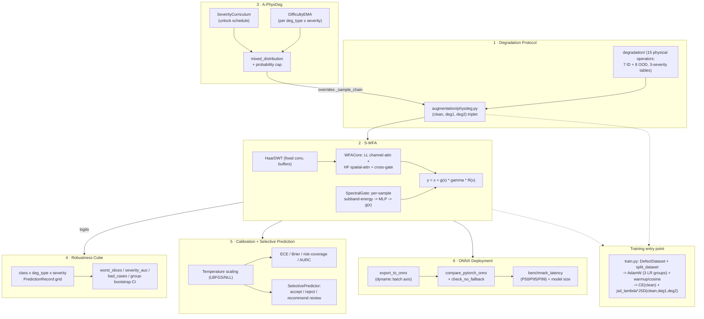

# Vision Robustness Toolkit

**A toolkit for building and evaluating corruption-robust industrial vision models** — a physically-grounded degradation protocol, a wavelet-domain sample-adaptive attention module, curriculum-driven adaptive augmentation, slice-based robustness evaluation, calibrated selective prediction, ONNX deployment validation, and a real ConvNeXt-Tiny + S-WFA training pipeline tying all of it together. 198 passing tests, zero GPU or proprietary data required to run any of it.

[](https://github.com/z8ri/vision-robustness-toolkit/actions/workflows/tests.yml)


[中文版 README](README.zh-CN.md)

---

## Data and provenance

The dataset this project targets is confidential and isn't included here, which is the one thing that keeps this from being run end-to-end in this repo. `data/dataset.py` reads a standard `root/<class_name>/<image>` layout — point `train.py` at a real directory in that shape on a machine with a GPU, and it trains. This repo's own tests run the identical code path against synthetic placeholder images instead (`tests/_synthetic.py`), so all 198 tests run on a laptop CPU in under two minutes, no GPU or dataset needed.

**Where this code comes from.** The degradation protocol, S-WFA, A-PhysDeg, Robustness Cube, calibration, and ONNX components were developed in a private research codebase (Feb–Jun 2026) behind an academic paper currently under submission. That codebase can't be published because it is tied to the confidential dataset. This repository is the public, dataset-free extraction of its reusable components, assembled on 2026-09-16 with fresh tests and a synthetic-data path. The commit history here reflects that extraction, not the original development timeline.

## Results

Numbers below come from the private research codebase described above — 69 GPU runs on the confidential dataset (5-seed repeats, multiple backbones and datasets), run before this public extraction existed. This repo shares the same component implementations but contains no data, so **these numbers are not reproducible from this repo**; they are reported to show what the components achieve in the setting they were built for. Baseline is ConvNeXt-Tiny with neither PhysDeg nor S-WFA.

| Stage | Clean macro-F1 | ID mPC (7 known corruptions) | OOD mPC (8 unseen corruptions) |
|---|---|---|---|
| Baseline | 98.2% | 84.2% | 73.5% |
| + A-PhysDeg (adaptive curriculum) + JSD consistency | – | 96.6% | – |
| + S-WFA (final, +1.5M params / +1% GMACs) | 97.6% | **97.4%** | **93.7%** |

- Closes **94%** of the clean-vs-corrupted gap, at a **0.6pp** cost to clean accuracy.
- Averaged over 5 seeds; consistent across backbones and datasets — not one lucky run.
- Calibrated selective prediction (temperature scaling + reject-on-low-confidence): **90%** auto-decision coverage at **1.8%** error rate on what's left.
- Exported model verified end-to-end: ONNX Runtime **P95 latency 6.2ms**.

## Why this exists

Robustness work for industrial visual inspection tends to raise the same six engineering questions, each usually solved badly or not at all in a typical research codebase:

1. How do you generate degraded training/eval data so that "severity 2 jpeg noise" means the *same physical thing* at train time and at eval time?
2. How do you build an attention module that can be *proven* to reduce to a well-understood baseline in a limiting case, instead of just asserting it's "an improvement"?
3. How do you make augmentation curriculum-aware without accidentally leaking test-time signal into the sampling distribution?
4. How do you stop a single mPC number from hiding a minority class collapsing under one specific corruption?
5. How do you turn raw softmax confidence into something a downstream system can actually trust enough to say "reject, send to a human"?
6. Does the module you just built actually survive being exported and run through a real inference runtime, or does it only work inside the training script?

Each component below is a self-contained, testable answer to one of these.

## Architecture



## Components

| # | Component | What it proves | Tests |
|---|---|---|---|
| 1 | [Degradation protocol](degradation/) + [static PhysDeg](augmentation/physdeg.py) | 7 in-distribution + 8 out-of-distribution physical corruption operators on one shared 3-severity parameter table, used identically at train and eval time | 32 |
| 2 | [S-WFA](models/wfa.py) | A wavelet-domain attention module that exactly reduces to a plain SE/spatial-attention baseline (`use_gate=False`) and to identity (`force_gate=0`) — both asserted by test, not just claimed | 16 |
| 3 | [A-PhysDeg](augmentation/a_physdeg.py) | Curriculum + difficulty-EMA + probability-capped adaptive sampling that is *statistically indistinguishable* from static PhysDeg in the fully-unlocked, uniform-difficulty limit (verified over 4000 draws) — a controlled, one-variable extension, not a parallel pipeline | 36 |
| 4 | [Robustness Cube](eval/cube.py) | Full class × degradation-type × severity slice decomposition, worst-slice reporting with a minimum-sample floor, severity-AUC, bad-case ranking, and **group-level** (not naive per-sample) bootstrap confidence intervals | 42 |
| 5 | [Calibration + selective prediction](calibration/) | Temperature scaling (Guo et al. 2017), ECE/Brier/NLL/AURC, and a `SelectivePredictor` that outputs "reject / recommend review" rather than ever inventing an "unknown" class | 32 |
| 6 | [ONNX export/verify/benchmark](deploy/) | A real model containing S-WFA actually exports to ONNX, agrees numerically with PyTorch to float32 precision, runs with no silent CPU fallback, and gets P50/P95/P99 latency + model-size measurements | 15 |
| — | [End-to-end integration](tests/test_integration_e2e.py) | All six components strung into one pipeline — A-PhysDeg sampling into a few real gradient steps through an S-WFA model, evaluated through the Robustness Cube, calibrated, and exported to ONNX — plus an [ONNX robustness-protocol regression check](tests/test_onnx_regression.py) confirming exported-model metrics match the PyTorch model's across the full ID/OOD protocol, not just on random tensors | 3 |
| — | [`ConvNeXtTinySWFA`](models/backbone.py) + [`DefectDataset`](data/dataset.py) + [`train.py`](train.py) | S-WFA inserted into the real integration point (ConvNeXt-Tiny Stage 3, after block 4 and block 8, 384 channels) behind a real `root/<class_name>/<image>` data loader and a real AdamW + warmup/cosine + CE+λ·JSD training loop — [`tests/test_train_smoke.py`](tests/test_train_smoke.py) runs this exact pipeline end-to-end on synthetic images | 22 |

**198 / 198 tests passing, CPU only.**

```bash
python3 -m venv .venv
source .venv/bin/activate
pip install -r requirements.txt
pytest -q
```

Implementation notes — including a real ONNX export bug found and fixed while building this — are in [`docs/ENGINEERING_NOTES.md`](docs/ENGINEERING_NOTES.md).

## Repository layout

```
degradation/    15 physical corruption operators + severity tables (params.py, ops.py)
augmentation/   PhysDegTransform (static) and APhysDegTransform (curriculum-adaptive)
models/         Haar DWT/IDWT, WFACore/SpectralGate/SWFA, ConvNeXtTinySWFA backbone
data/           DefectDataset (root/<class>/<image> loader) + seeded train/val/test split
losses/         the three-way JSD consistency loss train.py pairs with CE(clean)
eval/           evaluation protocol, RobustnessCube, group-bootstrap CI, split guards
calibration/    temperature scaling, calibration metrics, selective prediction
deploy/         a toy S-WFA-based model + ONNX export/verify/benchmark
train.py        real training entry point: data -> augmentation -> backbone -> loss -> checkpoint
tests/          198 tests, all runnable on synthetic data with no GPU
docs/           deeper engineering narrative
```

## License

[MIT](LICENSE) — use it, fork it, ask questions about it.

---

Author: [@z8ri](https://github.com/z8ri)
