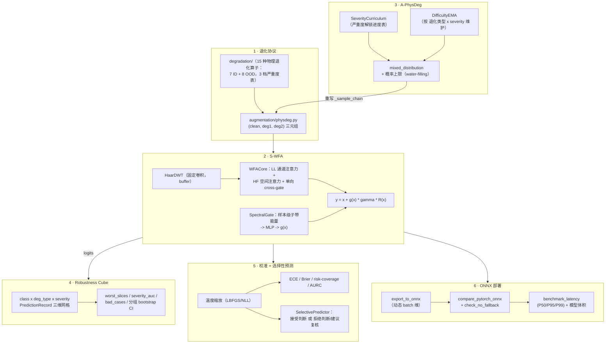

# Vision Robustness Toolkit（工业视觉鲁棒性工具箱）

**一个从零实现的工业视觉鲁棒性工具箱**：物理退化协议、样本级自适应小波域注意力模块、课程式自适应数据增强、按切片分解的鲁棒性评测、校准后的选择性预测，以及 ONNX 部署验证。六个相互独立的组件，外加一个证明它们真能拼起来跑通的端到端整合测试，176 个测试全部通过，跑通任何一个都不需要 GPU 或私有数据。

[](https://github.com/z8ri/vision-robustness-toolkit/actions/workflows/tests.yml)


[English README](README.md)

---

## ⚠️ 范围、诚实声明与数据说明

这是一个**面向求职/面试展示的工程作品集项目**，不是任何具体投稿论文背后的代码库。请先读完这一节再看下面的内容——它决定了整个仓库该怎么被理解。

- **不包含、也不需要任何私有/机密数据集。** 这个设计所参考的原始工业缺陷数据集是机密文件，无法公开。仓库里所有测试跑的都是合成生成的灰度图像（`tests/_synthetic.py`）或手工构造的张量——整套测试在笔记本 CPU 上几秒钟就能跑完。
- **没有用 GPU，没有真实训练出的 checkpoint，没有跑过真实训练。** 六个组件全部停留在单元测试/整合测试层面：验证的是正确性性质（能量守恒、与简化基线的精确/统计等价性、温度缩放不改变 argmax、ONNX 与 PyTorch 数值一致……），而不是"在真实数据集上是否提升了精度"。你如果在别处看到过描述这个项目理想版本的具体精度/延迟数字，那些是**理论推演**，本仓库没有复现、也不声称复现过那些数字。
- **这个仓库真正的价值：** 六个有一定复杂度的机器学习系统组件的真实、可运行的实现，每个组件的测试套件都在认真尝试证伪自己的设计主张，而不只是跑通就算数。

## 为什么做这个

工业视觉检测的鲁棒性工作通常会反复遇到同样六个工程问题，而在典型的科研代码库里这些问题往往被草草处理甚至完全忽略：

1. 怎么生成退化数据，才能让"severity 2 的 jpeg 噪声"在训练阶段和评测阶段指的是*同一个物理量*？
2. 怎么设计一个注意力模块，让它在极限情形下能被*证明*退化为一个已经被充分理解的基线，而不是仅仅口头声称"有提升"？
3. 怎么让数据增强具备课程感知能力，同时不会不小心把测试期的信号泄漏进采样分布？
4. 怎么避免一个 mPC 总分掩盖掉某个少数类在某个特定退化下的崩溃？
5. 怎么把原始 softmax 置信度转化成下游系统真正敢用来做"拒绝判断、转人工复核"决策的东西？
6. 你刚写好的模块，导出后真的能在真实推理引擎里跑起来吗，还是只在训练脚本里能用？

下面每个组件都是对其中一个问题的、可独立测试的回答。

## 架构



## 组件一览

| # | 组件 | 证明了什么 | 测试数 |
|---|---|---|---|
| 1 | [退化协议](degradation/) + [静态 PhysDeg](augmentation/physdeg.py) | 7 种 ID + 8 种 OOD 物理退化算子，共用一张 3 档严重度参数表，训练期和评测期口径完全一致（见下方[方法论修正说明](#一个刻意的方法论修正)） | 32 |
| 2 | [S-WFA](models/wfa.py) | 一个小波域注意力模块，能在 `use_gate=False` 时精确退化为普通 SE+空间注意力基线，在 `force_gate=0` 时精确退化为恒等映射——两者都由测试断言验证，不是口头声称 | 16 |
| 3 | [A-PhysDeg](augmentation/a_physdeg.py) | 课程学习 + 困难度 EMA + 概率上限的自适应采样，在"全部解锁、难度均匀"的极限情形下与静态 PhysDeg *统计不可区分*（4000 次抽样验证）——是受控的单变量扩展，不是另起炉灶的并行方案 | 36 |
| 4 | [Robustness Cube](eval/cube.py) | 完整的 类别 × 退化类型 × severity 三维切片分解、带最小样本量门槛的最差切片报告、severity-AUC、bad-case 排序，以及**分组级**（而非朴素逐样本）bootstrap 置信区间 | 42 |
| 5 | [校准 + 选择性预测](calibration/) | 温度缩放（Guo et al. 2017）、ECE/Brier/NLL/AURC，以及一个只会输出"拒绝判断/建议复核"、绝不会编造"未知类别"的 `SelectivePredictor` | 32 |
| 6 | [ONNX 导出/验证/基准测试](deploy/) | 一个真实包含 S-WFA 的模型确实能导出为 ONNX，与 PyTorch 数值精度对齐到 float32 级别，无静默 CPU 回退，并测得 P50/P95/P99 延迟 + 模型体积 | 15 |
| — | [端到端整合测试](tests/test_integration_e2e.py) | 把六个组件串成一条链：A-PhysDeg 采样 -> 过一个真实做了几步梯度更新的 S-WFA 模型 -> Robustness Cube 评测 -> 校准 -> ONNX 导出；外加一个 [ONNX 鲁棒性协议回归测试](tests/test_onnx_regression.py)，确认导出后的模型在完整 ID/OOD 协议下与 PyTorch 模型数值一致，而不只是在随机张量上对得上 | 3 |

**176 / 176 测试通过，纯 CPU。**

```bash
python3 -m venv .venv
source .venv/bin/activate
pip install -r requirements.txt
pytest -q
```

## 一个值得一读的工程故事

组件 2 的 Haar 小波变换最初是用自由函数实现的，每次前向传播都临时构建一次 depthwise 卷积核。它当时自己的 16 个测试全部通过。但它其实**无法导出为 ONNX**——四个组件之后，在组件 6 里，`torch.onnx.export` 报错 `Unsupported: ONNX export of convolution for kernel of unknown shape`。修复方式（把固定卷积核在 `__init__` 里注册成 module buffer，而不是每次调用时重新构建）只改了三行。但要发现这个问题，必须真的去做一次端到端的集成尝试，而不能想当然地认为"基于卷积实现"就自动等于"可导出"。完整的故事，以及过程中修复的其他几个真实 bug，写在 [`docs/ENGINEERING_NOTES.md`](docs/ENGINEERING_NOTES.md) 里。

## 设计原则

- **凡是"一次误操作就能泄漏"的地方都加防护栏。** A-PhysDeg 的诊断批次要求显式传 `split="train"`，Cube 的 `FinalizeGuard` 守着 `test`/`ood`，`SelectivePredictor.fit` 要求 `split="calibration"`——三个互不相关的组件用了同一套纪律，因为"悄悄地在留出集上多看一眼"是产生一个复现不出来的数字最容易的方式。
- **设计主张是测试用例，不是注释里的一句话。** "A-PhysDeg 在极限情形下退化为静态 PhysDeg""原始 WFA 就是把门控强制设为 1 的 S-WFA""温度缩放不改变 argmax"——每一条都是测试套件里真正断言过的，是实测验证，不是接受了就算数的设计意图。
- **每个模块都明确写清楚自己没证明什么。** 在没有 GPU 的机器上无法测试 GPU 回退检测，测试里就老实写清楚这一点，而不是悄悄跳过这个真正有意思的场景。`ToyDefectClassifier` 明确是一个手写的小模型，不冒充生产环境的主干网络。这里没有任何一处声称了自己没有的覆盖率。

## 一个刻意的方法论修正

这个项目所参考的设计中，同一种退化类型保留了两张不同的参数表——一张训练期用，另一张（严重度数值不同）评测期用。本仓库刻意改成每种退化类型只用*一张* 3 档严重度表，训练期增强和评测期腐化共用同一张表，这样"severity 2"在任何被引用的地方指的都是同一个物理扰动。细节见 `degradation/params.py` 模块文档字符串。

## 仓库结构

```
degradation/    15 种物理退化算子 + 严重度参数表（params.py, ops.py）
augmentation/   PhysDegTransform（静态）与 APhysDegTransform（课程自适应）
models/         Haar DWT/IDWT（固定卷积，可 ONNX 导出）+ WFACore + SpectralGate + SWFA
eval/           评测协议、RobustnessCube、分组 bootstrap CI、split guard
calibration/    温度缩放、校准指标、选择性预测
deploy/         一个含 S-WFA 的小模型 + ONNX 导出/验证/基准测试
tests/          173 个测试，全部可在合成数据上跑通，不需要 GPU
docs/           更深入的工程叙事文档
```

## License

[MIT](LICENSE) —— 拿去用、fork、有问题欢迎交流。

---

作者：[@z8ri](https://github.com/z8ri)
