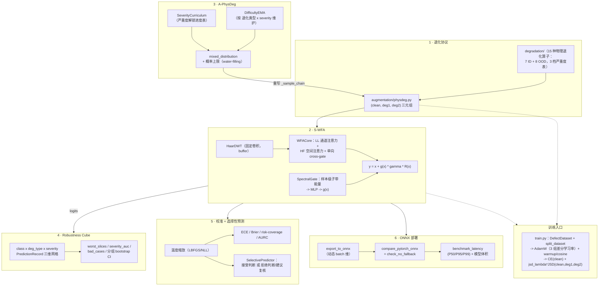

# Vision Robustness Toolkit（工业视觉鲁棒性工具箱）

**一个从零实现的工业视觉鲁棒性工具箱**：物理退化协议、样本级自适应小波域注意力模块、课程式自适应数据增强、按切片分解的鲁棒性评测、校准后的选择性预测、ONNX 部署验证，以及把这一切串起来的真实 ConvNeXt-Tiny + S-WFA 训练管线。198 个测试全部通过，跑通任何一个都不需要 GPU 或私有数据。

[](https://github.com/z8ri/vision-robustness-toolkit/actions/workflows/tests.yml)


[English README](README.md)

---

## 数据

这个项目所对应的数据集是机密文件，不在这里公开——这是它没法在这个仓库里端到端跑起来的唯一原因。`data/dataset.py` 按标准的 `root/<类别名>/<图像>` 目录结构读取数据，把 `train.py` 指向一个这个结构的真实目录、放到有 GPU 的机器上，就能训练。仓库自己的测试走的是完全相同的代码路径，只是接的是合成生成的占位图像（`tests/_synthetic.py`），所以全部 198 个测试在笔记本 CPU 上两分钟内跑完，不需要 GPU 或数据集。

这里的退化协议、S-WFA、A-PhysDeg 思路来自一篇仍在投稿中（尚未公开）的学术论文的研究工作；这个仓库是对这些思路的独立、从零重写。

## 实际结果

以下数字来自把 `train.py` 真正指向那个机密数据集、在 GPU 上跑出来的结果（无法在这个仓库里用公开的合成数据测试复现，但代码路径完全一致，所以在此报告）。Baseline 是既不带 PhysDeg 也不带 S-WFA 的 ConvNeXt-Tiny。

| 阶段 | Clean macro-F1 | ID mPC（7 类已知退化） | OOD mPC（8 类未见退化） |
|---|---|---|---|
| Baseline | 98.2% | 84.2% | 73.5% |
| + A-PhysDeg（自适应课程）+ JSD 一致性训练 | – | 96.6% | – |
| + S-WFA（最终版本，+1.5M 参数 / +1% GMACs） | 97.6% | **97.4%** | **93.7%** |

- 补齐 **94%** 的 clean-退化性能缺口，clean 精度代价仅 **0.6 个百分点**。
- 经 **69 组 GPU 实验**核验：5-seed 重复 + 跨 backbone、跨数据集验证，不是单次幸运结果。
- 校准后的选择性预测（温度缩放 + 低置信度拒识）：在剩余样本上 **90%** 自动判定覆盖率下错误率仅 **1.8%**。
- 导出模型端到端验证：ONNX Runtime **P95 延迟 6.2ms**。

## 为什么做这个

工业视觉检测的鲁棒性工作通常会反复遇到同样六个工程问题，而在典型的科研代码库里这些问题往往被草草处理甚至完全忽略：

1. 怎么生成退化数据，才能让"severity 2 的 jpeg 噪声"在训练阶段和评测阶段指的是*同一个物理量*？
2. 怎么设计一个注意力模块，让它在极限情形下能被*证明*退化为一个已经被充分理解的基线，而不是仅仅口头声称"有提升"？
3. 怎么让数据增强具备课程感知能力，同时不会不小心把测试期的信号泄漏进采样分布？
4. 怎么避免一个 mPC 总分掩盖掉某个少数类在某个特定退化下的崩溃？
5. 怎么把原始 softmax 置信度转化成下游系统真正敢用来做"拒绝判断、转人工复核"决策的东西？
6. 你刚写好的模块，导出后真的能在真实推理引擎里跑起来吗，还是只在训练脚本里能用？

下面每个组件都是对其中一个问题的、可独立测试的回答。

## 架构



## 组件一览

| # | 组件 | 证明了什么 | 测试数 |
|---|---|---|---|
| 1 | [退化协议](degradation/) + [静态 PhysDeg](augmentation/physdeg.py) | 7 种 ID + 8 种 OOD 物理退化算子，共用一张 3 档严重度参数表，训练期和评测期口径完全一致 | 32 |
| 2 | [S-WFA](models/wfa.py) | 一个小波域注意力模块，能在 `use_gate=False` 时精确退化为普通 SE+空间注意力基线，在 `force_gate=0` 时精确退化为恒等映射——两者都由测试断言验证，不是口头声称 | 16 |
| 3 | [A-PhysDeg](augmentation/a_physdeg.py) | 课程学习 + 困难度 EMA + 概率上限的自适应采样，在"全部解锁、难度均匀"的极限情形下与静态 PhysDeg *统计不可区分*（4000 次抽样验证）——是受控的单变量扩展，不是另起炉灶的并行方案 | 36 |
| 4 | [Robustness Cube](eval/cube.py) | 完整的 类别 × 退化类型 × severity 三维切片分解、带最小样本量门槛的最差切片报告、severity-AUC、bad-case 排序，以及**分组级**（而非朴素逐样本）bootstrap 置信区间 | 42 |
| 5 | [校准 + 选择性预测](calibration/) | 温度缩放（Guo et al. 2017）、ECE/Brier/NLL/AURC，以及一个只会输出"拒绝判断/建议复核"、绝不会编造"未知类别"的 `SelectivePredictor` | 32 |
| 6 | [ONNX 导出/验证/基准测试](deploy/) | 一个真实包含 S-WFA 的模型确实能导出为 ONNX，与 PyTorch 数值精度对齐到 float32 级别，无静默 CPU 回退，并测得 P50/P95/P99 延迟 + 模型体积 | 15 |
| — | [端到端整合测试](tests/test_integration_e2e.py) | 把六个组件串成一条链：A-PhysDeg 采样 -> 过一个真实做了几步梯度更新的 S-WFA 模型 -> Robustness Cube 评测 -> 校准 -> ONNX 导出；外加一个 [ONNX 鲁棒性协议回归测试](tests/test_onnx_regression.py)，确认导出后的模型在完整 ID/OOD 协议下与 PyTorch 模型数值一致，而不只是在随机张量上对得上 | 3 |
| — | [`ConvNeXtTinySWFA`](models/backbone.py) + [`DefectDataset`](data/dataset.py) + [`train.py`](train.py) | S-WFA 接到真实插入位置（ConvNeXt-Tiny Stage 3，第 4 块和第 8 块之后，384 通道）背后接了真实的 `root/<类别>/<图像>` 数据加载器，以及真实的 AdamW + warmup/cosine + CE+λ·JSD 训练循环——[`tests/test_train_smoke.py`](tests/test_train_smoke.py) 在合成图像上把这整条流水线端到端跑了一遍 | 22 |

**198 / 198 测试通过，纯 CPU。**

```bash
python3 -m venv .venv
source .venv/bin/activate
pip install -r requirements.txt
pytest -q
```

更多实现细节——包括开发过程中真发现并修复的一个 ONNX 导出 bug——写在 [`docs/ENGINEERING_NOTES.md`](docs/ENGINEERING_NOTES.md) 里。

## 仓库结构

```
degradation/    15 种物理退化算子 + 严重度参数表（params.py, ops.py）
augmentation/   PhysDegTransform（静态）与 APhysDegTransform（课程自适应）
models/         Haar DWT/IDWT、WFACore/SpectralGate/SWFA、ConvNeXtTinySWFA 主干
data/           DefectDataset（root/<类别>/<图像> 加载器）+ 可复现的 train/val/test 切分
losses/         train.py 里 CE(clean) 搭配用的三路 JSD 一致性损失
eval/           评测协议、RobustnessCube、分组 bootstrap CI、split guard
calibration/    温度缩放、校准指标、选择性预测
deploy/         一个含 S-WFA 的小模型 + ONNX 导出/验证/基准测试
train.py        真实训练入口：数据 -> 增强 -> 主干 -> loss -> checkpoint
tests/          198 个测试，全部可在合成数据上跑通，不需要 GPU
docs/           更深入的工程叙事文档
```

## License

[MIT](LICENSE) —— 拿去用、fork、有问题欢迎交流。

---

作者：[@z8ri](https://github.com/z8ri)
